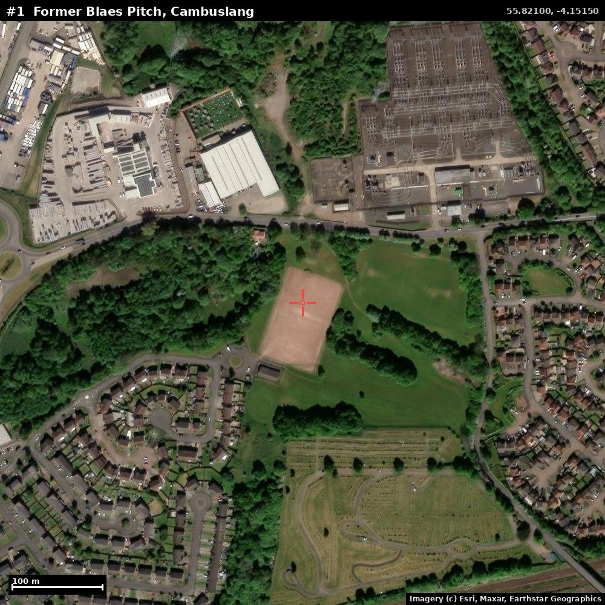
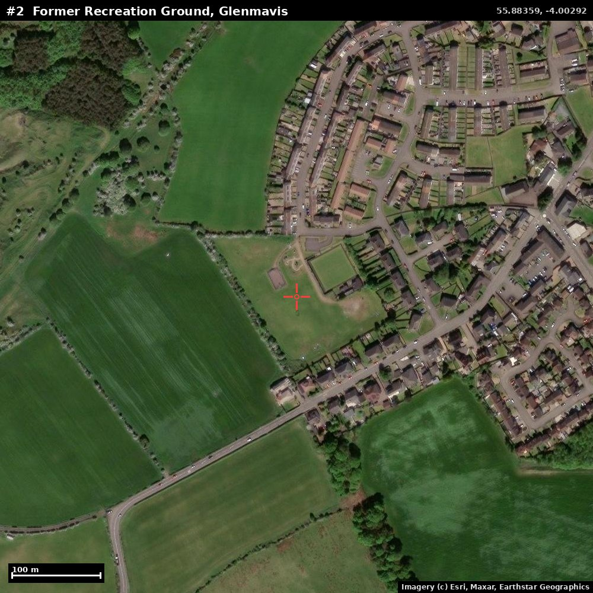
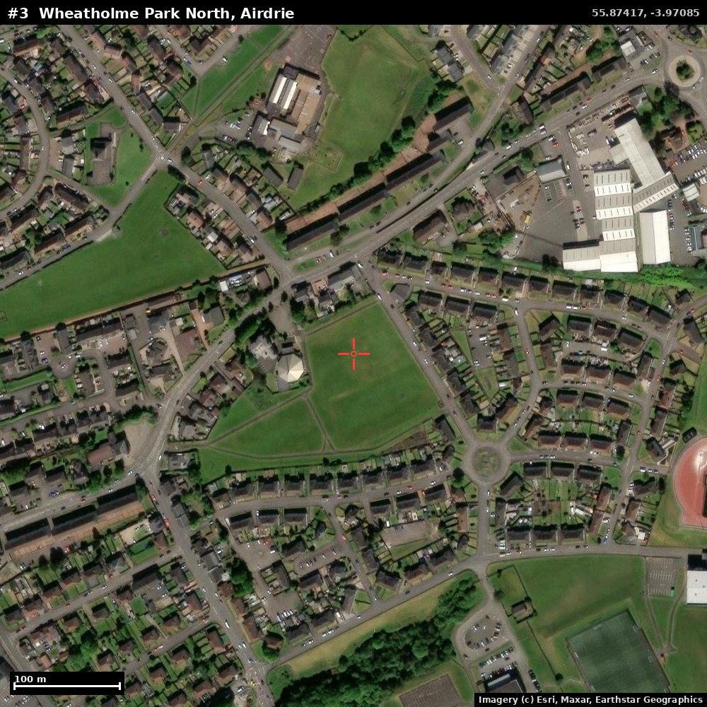
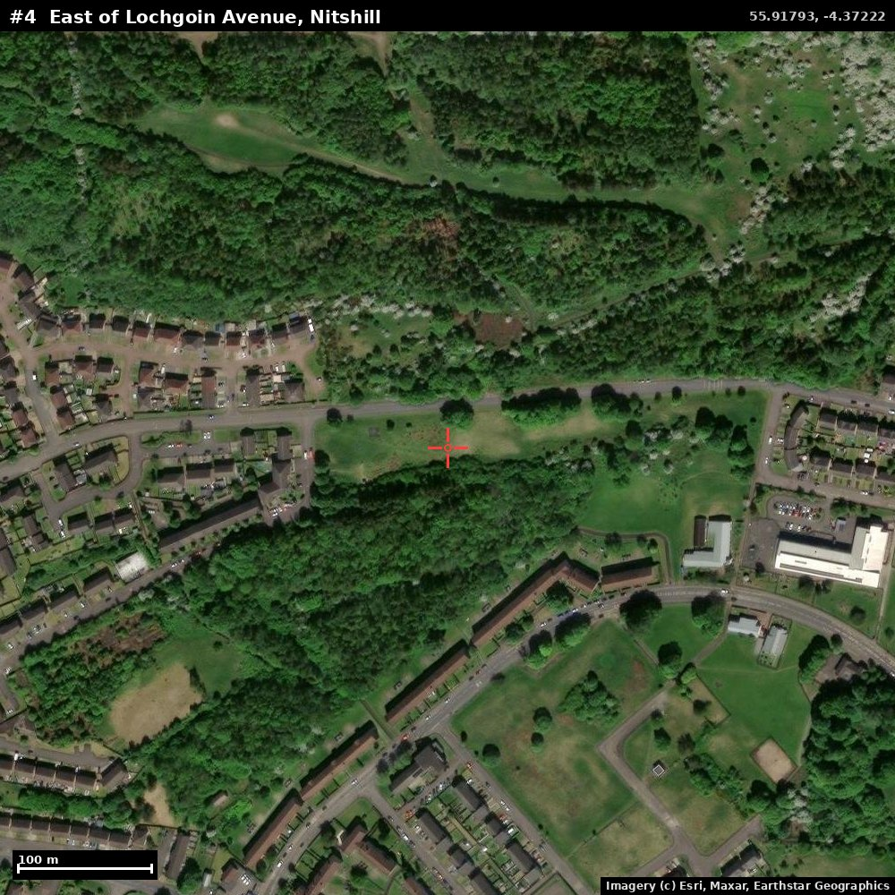
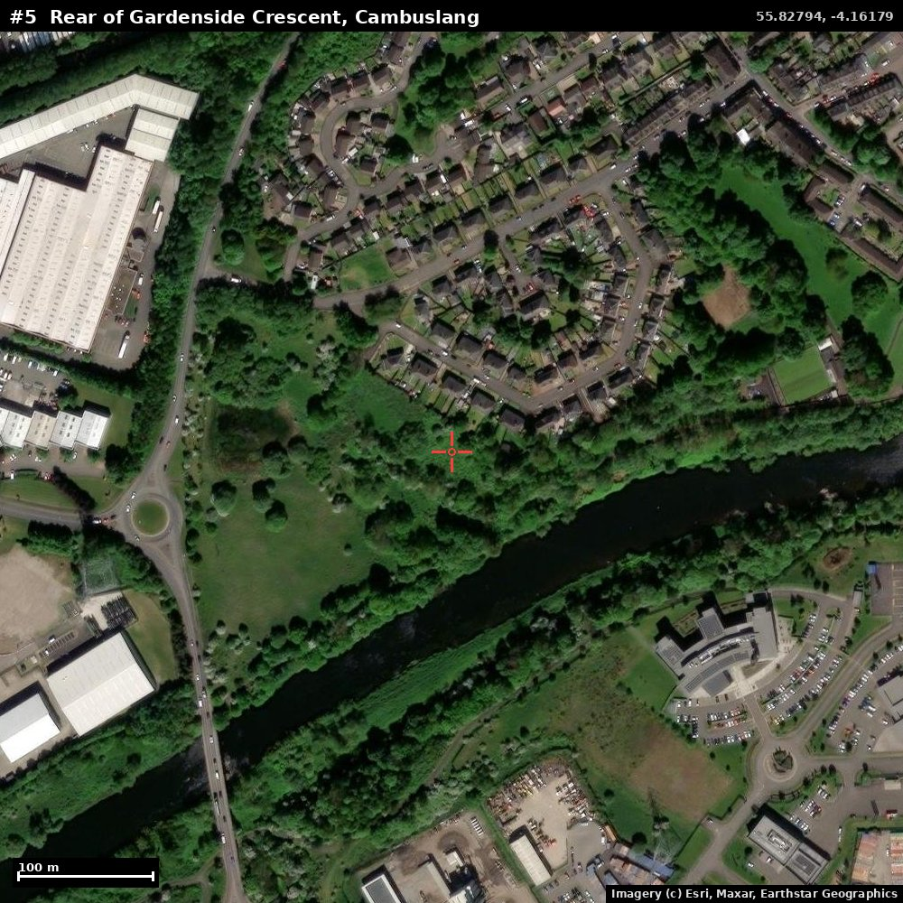
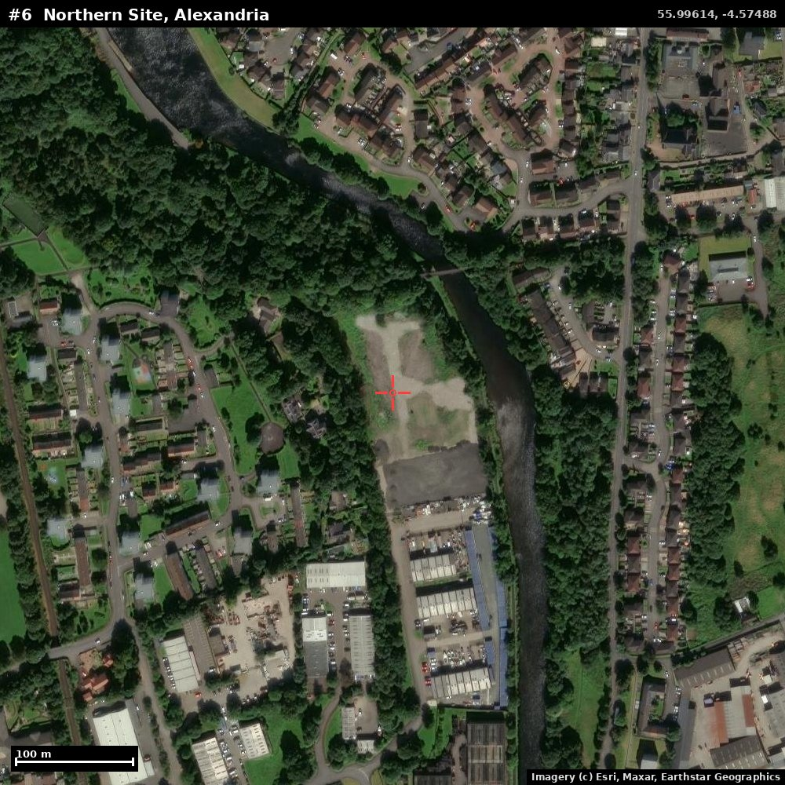
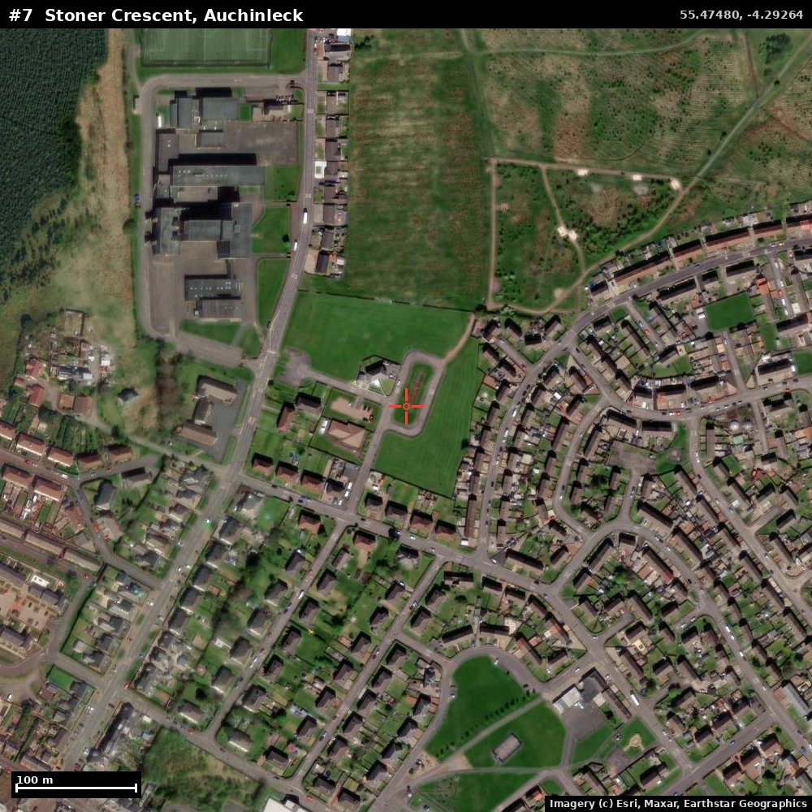

# Satellite views of the shortlisted sites

Free Esri World Imagery, stitched and annotated by
[`analysis/fetch_satellite.py`](../../analysis/fetch_satellite.py). The red
crosshair marks the exact site centroid from the survey; each frame is ~670 m
across (100 m scale bar, bottom-left). Cross-check against the live
[Google Maps links in REPORT.md](../../REPORT.md) before relying on any of these.

*Imagery © Esri, Maxar, Earthstar Geographics and the GIS User Community.*

## 1. Former Blaes Pitch, Cambuslang ⭐ (top pick)
The crosshair sits on a red-blaes football pitch ringed by open green space — a near like-for-like with the Craufurdland plot.

## 2. Former Recreation Ground, Glenmavis

## 3. Wheatholme Park North, Airdrie

## 4. East of Lochgoin Avenue, Nitshill

## 5. Rear of Gardenside Crescent, Cambuslang

## 6. Northern Site, Alexandria

## 7. Stoner Crescent, Auchinleck (East Ayrshire option)

